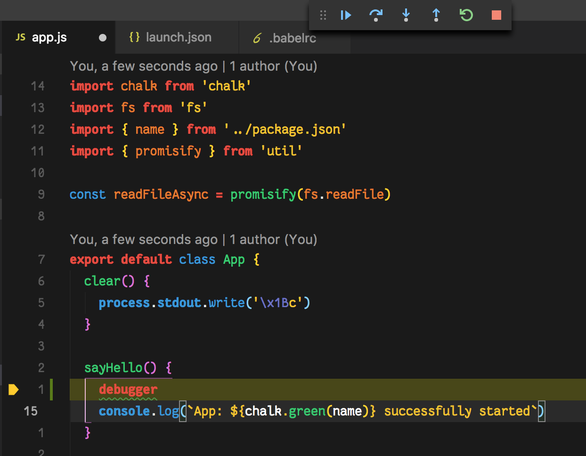
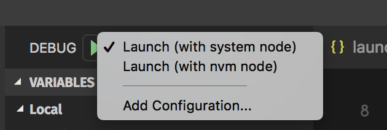

# Create Node App

Boilerplate to get you started with creating a nodejs app. You have ES6/7, corresponding linting rules, a debugging config for `vscode`, Jest test runner.

The boilerplate is meant to be lean, and functional. No tie-up with any plugins like Express and the likes. It's a barebones NodeJS app with live-reload, testing, test-coverage and a simple TravisCI build.

## Debug in vscode

### Using NVM? Got you covered

Progress Tracker

- [ ] use `create-new-cli` to provision node app
- [X] perform live-reload of all scripts using nodemon
- [X] provide testing using Jest
- [X] provide TravisCI basic testing
- [ ] provide codacy stats
- [X] provide code coverage
- [X] provide sane linting rules (currently based on Airbnb but allows goodies like dangling commas and semi-colon-free development)
- [X] use async/await/promisify
- [ ] allow options for 3rd party linting rules (standard, airbnb)
- [X] debug using vscode's node debugger
  - [ ] use babel sourcemaps during debgging (workaround, use `debugger`)
